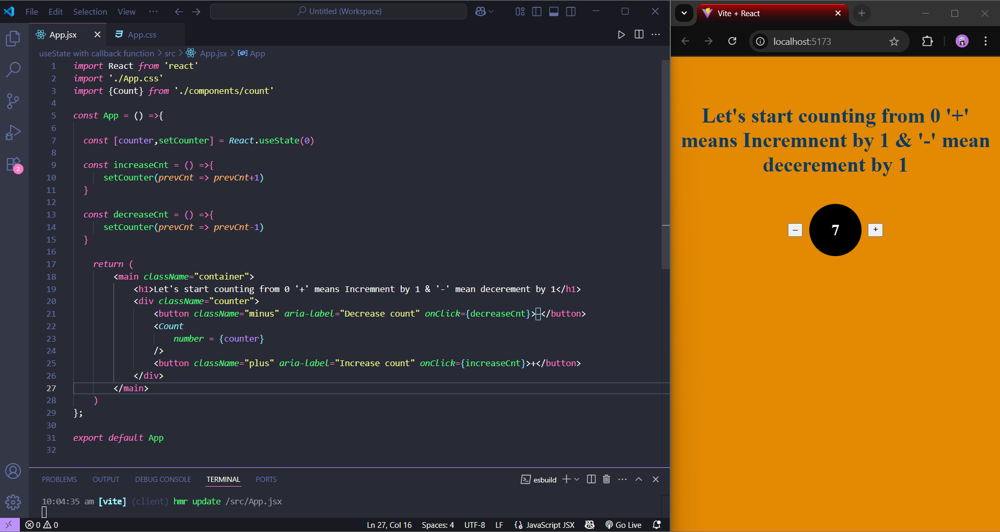

# React useState and callback function

This is a simple React-based counter application that demonstrates the use of the useState hook and callback functions for state management. The app allows users to increment or decrement a counter value using "+" and "–" buttons. The current count is displayed using a separate Count component, which receives the counter value as a prop from the parent. State updates are handled using functional updates to ensure reliable and predictable changes.

# #React State #React Hooks

Output Screen Shot

